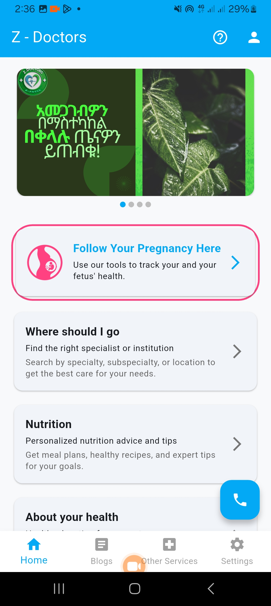
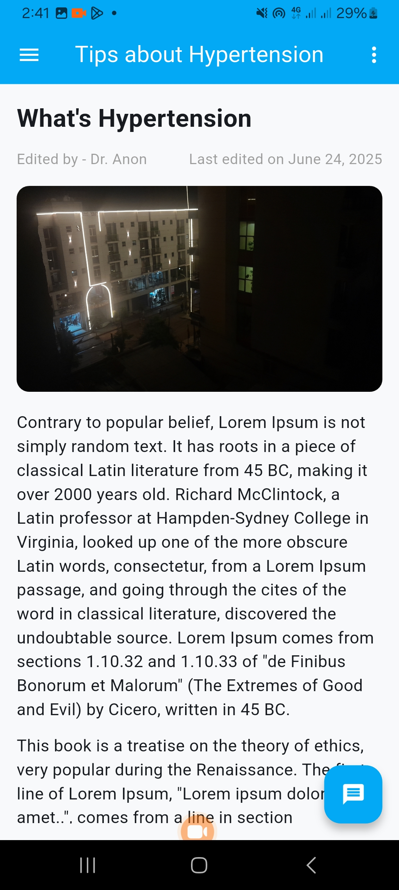
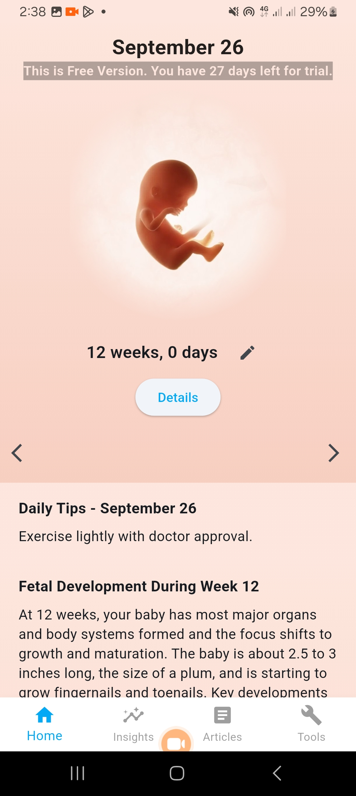
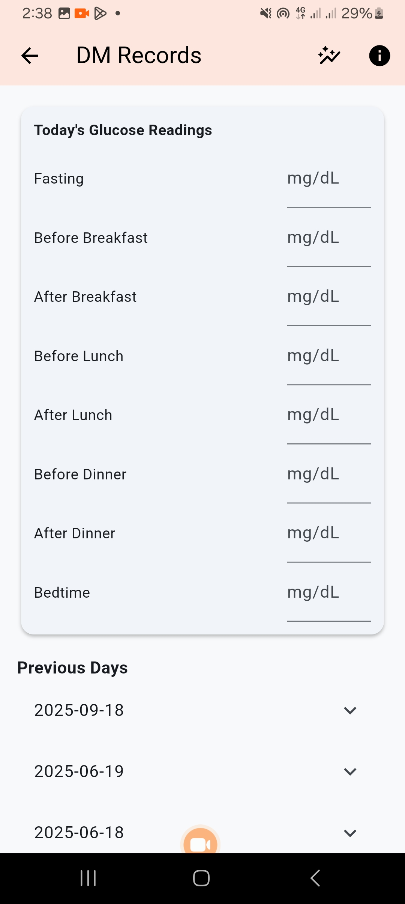
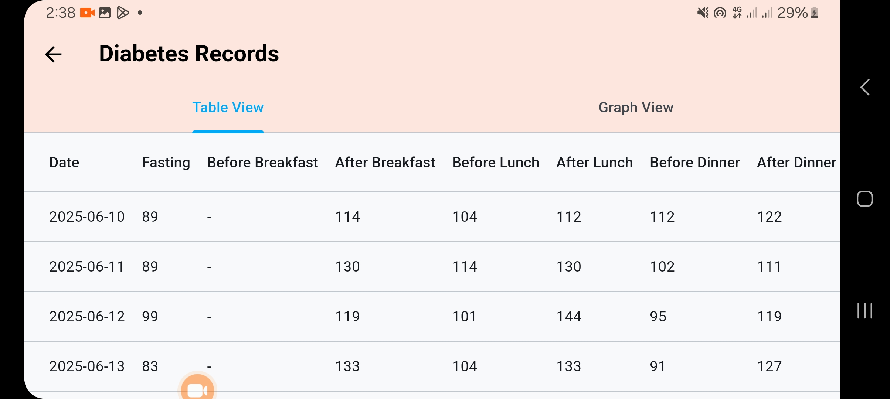
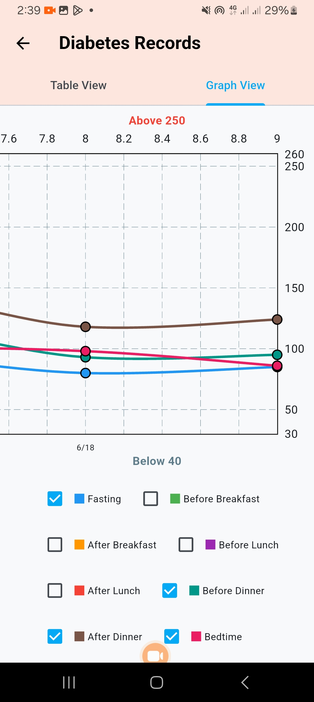
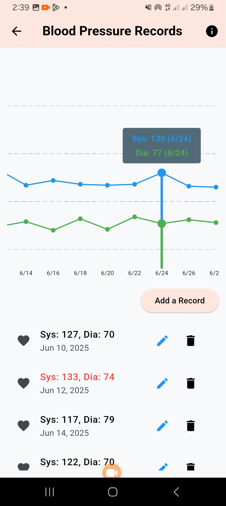
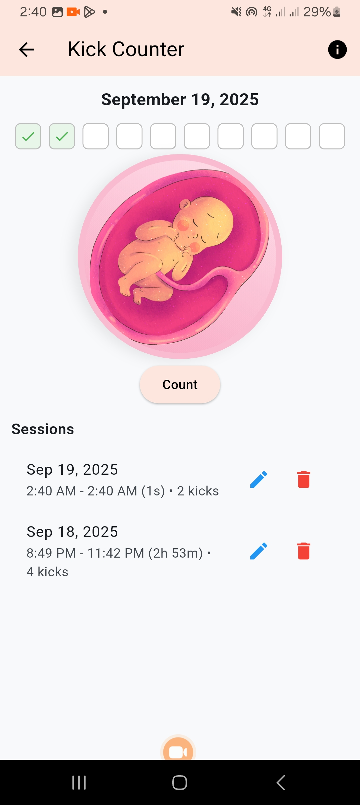

# z-doctors
An app with all the tools and uptodate information about health practices directly from the doctors.

---

## 📝 Overview
**Z - Doctors** is designed to help patients get reliable medical information on the go from certified doctors.
Built with **Flutter & Dart**, it offers a clean UI, local storage, and a focus on usability.

---

## 🚀 Features
- Patient data management (records, appointments, follow-ups)
- Health education
- Directory of Health institutions and professionals
- Tools for pattern analysis and recommendation
- Local and push notifications
- Local storage with **SQLite**
- Data kept in sync with firestore
- Secure authentication (Firebase Auth ready)
- Supports subscription and trial period
- Material Design interface with responsive layouts  
- Multi-language support (English & Amharic)
- Has an admin companion app 

---

## 🛠 Tech Stack
- **Frontend:** Flutter (Dart)  
- **Backend/Services:** Firebase (Auth, Firestore, Storage, Messaging)  
- **Database:** SQLite  
- **Tools:** Firebase Console, Android Studio

---

## 📸 Screenshots

| Home Screen | Health Education | Pregnancy Followup |
|--------------|-----------|--------------|
|  |  |  |

| Glucose Monitoring | Glucose table | Glucose graph |
|--------------|-----------|--------------|
|  |  |  |

| BP Monitoring | Kick Counter | Physicians |
|--------------|-----------|--------------|
|  |  |  |

---

## 🎥 Demo Video

## 📌 Status

🚧 Currently under development

