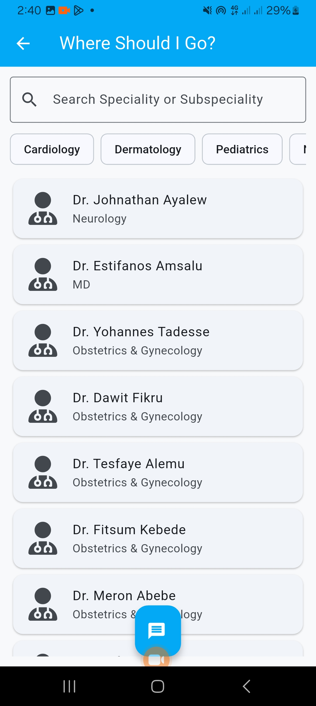

# z-doctors
An app with all the tools and uptodate information about health practices directly from the doctors.

*A private Flutter/Dart project — this repository is for showcasing features, screenshots, and demo materials.*

---

## 📝 Overview
**Z - Doctors** is designed to help patients get reliable medical information on the go from certified doctors.
Built with **Flutter & Dart**, it offers a clean UI, local storage, and a focus on usability.

---

## 🚀 Features
- Patient data management (records, appointments, follow-ups)
- Health education
- Directory of Health institutions and professionals
- Tools for pattern analysis and recommendation
- Local storage with **SQLite**  
- Secure authentication (Firebase Auth ready)  
- Material Design interface with responsive layouts  
- Multi-language support (English & Amharic)  

---

## 🛠 Tech Stack
- **Frontend:** Flutter (Dart)  
- **Backend/Services:** Firebase (Auth, Firestore, Storage, Messaging)  
- **Database:** SQLite  
- **Tools:** Firebase Console, Android Studio

---

## 📸 Screenshots

| Home Screen | Health Education | Pregnancy Followup |
|--------------|-----------|--------------|
|  |  |  |

| Glucose Monitoring | Glucose table | Glucose graph |
|--------------|-----------|--------------|
|  |  |  |

| BP Monitoring | Kick Counter | Physicians |
|--------------|-----------|--------------|
|  |  |  |

---

## 🎥 Demo Video

![App Demo](./demo/demo.mp4
